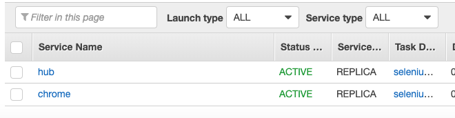
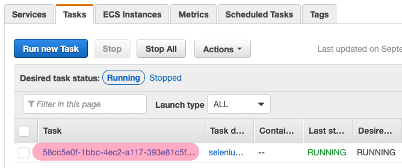
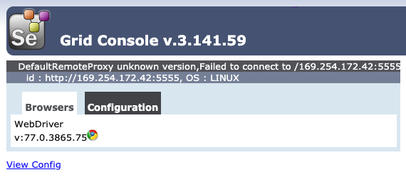

Seleum Grid is great and it's a breeze to get it started up locally, where things get a bit heavier is when you actually want to deploy it for real instead of just on your local machine.

# Table of Contents
* [Why Fargate?](#why-fargate)
* [Setup](#setup)
* [Registering Tasks](#registering-tasks)
* [Create Services](#create-services)
* [Wrapping Up](#wrapping-up)
* [Further Topics](#further-topics)

<a id="why-fargate"></a>
## Why Fargate?
There are a few ways to get this setup on AWS, my initial attempt was to simply setup a small cluster of EC2 nodes, and deploy the compose file that [Selenium provides](https://github.com/SeleniumHQ/docker-selenium/wiki/Getting-Started-with-Docker-Compose)

This worked, but there were problems:
*  It requires manually managing EC2 instances and the cluster itself.
*  Docker Swarm doesn't really "do" orchestration, so it's easy to end up with a bunch of containers shoved onto a single instance while your un-occupied instances sit around looking bored (and costing money).

Fargate sounded attactive because not only would it handle orchestration, but managing the instances as well. This meant it would be easier to scale horizontally or vertically. The catch is that like most AWS services, it requires doing things the "AWS Way". Really this just boiled down to mapping some of Fargate's terminology to concepts that were more familiar to me coming from Docker Swarm.

- **Task Definitions** can be thought of similar to service definitions in a `docker-compose` file, they define the image, resources, ports, volumes, etc.
- **Service Definitions** outline you AWS-specific info like security groups, execution roles, and networking. These deploy your task definition to the cluster.

<a id="setup"></a>
## Setup
Before we get started we'll need to setup some permissions and roles to allow our cluster's containers to do their thing.

### Create Roles
Open the IAM Role dashboard, and create two roles: one for the ECS service, and one for ECS tasks. **Make sure to add the `AmazonECSTaskExecutionRolePolicy` permission to the task's role.**

### Configure the VPC
First and most importantly if you don't want to pull out a lot of hair: **in order for ECS to be able to pull container images, you'll need to either configure a private subnet within your VPC *or* assign public IP addresses to the services running in the cluster.** Since Selenium Grid has no authentication mechanism built in ([unless you feel like tooling around](https://stackoverflow.com/questions/44703347/how-to-set-up-secured-authentication-on-selenium-grid-for-connections-and-node-r), then theoretically this means anyone with the hub IP could use your cluster to run jobs. Not cool. The optimal setup is deploying on a private subnet, then jumping on a VPN to access it.

Next, you'll need to setup a private DNS namespace so that containers can communicate with eachother by hostname. This is pretty simple to do from the CLI. If you prefer the GUI, you can also set this up using the AWS Cloud Map tool. If you have an existing namespace, feel free to skip this step and use that instead.

For the purposes of this guide we'll assume the namespace is `local`.

```
aws servicediscovery create-private-dns-namespace --name local --vpc <VPC ARN>
```

## Create an ECS cluster
First we need to create our cluster so we can assign "tasks" to it.

```bash
aws ecs create-cluster --cluster-name selenium-grid
```

You should see some output like:

```
{
    "cluster": {
        "clusterArn": "arn:aws:ecs:us-east-1:438384420157:cluster/selenium-grid",
        "clusterName": "selenium-grid",
        "status": "ACTIVE",
        "registeredContainerInstancesCount": 0,
        "runningTasksCount": 0,
        "pendingTasksCount": 0,
        "activeServicesCount": 0,
        "statistics": [],
        "tags": [],
        "settings": [
            {
                "name": "containerInsights",
                "value": "disabled"
            }
        ]
    }
}
```

<a id="registering-tasks"></a>
## Registering tasks
There are actually two ways to define tasks: you can either use the approach I took here and piece together some JSON files for each of your tasks and services, or you can actually use `docker-compose.yml` and the `aws ecs-cli compose` (command)[https://docs.aws.amazon.com/AmazonECS/latest/developerguide/cmd-ecs-cli-compose.html] -- *but* be aware that there's a caveat (it's AWS -- there's *always* a caveat):

**AWS treats the entire compose file as a single task, with all the services within it sharing a fixed amount of resources.**

This is useful for some situations, but in this case we actually want our hub and browser containers to have their own dedicated resources, so instead what we'll do is define a task for each service. This lets us easily scale things horizontally or vertically.

### Hub task 
This is where the `docker-compose.yml` helps out. We might not want to use it directly, but we can reference it to figure out how to define our containers. For example our hub task from our compose file is pretty simple:

```yml
  hub:
   image: selenium/hub:3.141.59-uranium
   ports:
     - "4444:4444"
```

Beyond pulling the image we just need to open up port `4444`. Additionally we'll need to define some AWS-specific info like task/execution roles, security groups, and networking. 

```javascript
{
    "family": "selenium-grid-hub", 
    "networkMode": "awsvpc",
    "taskRoleArn": "<TASK ROLE ARN>",
    "executionRoleArn": "<EXECUTION ROLE ARN>",
    "containerDefinitions": [
        {
            "name": "hub", 
            "image": "selenium/hub@3.141", 
            "portMappings": [
                {
                "hostPort": 4444,
                "protocol": "tcp",
                "containerPort": 4444
                }
            ], 
            "essential": true, 
            "entryPoint": [], 
            "command": []
        }
    ], 
    "requiresCompatibilities": [
        "FARGATE"
    ], 
    "cpu": "1024", 
    "memory": "2048"
}
```

Register the Hub task with the command:

```bash
aws ecs register-task-definition --cli-input-json file://hub-task.json
```

### Chrome Task

Similarly when we examine the `docker-compose` definition for the chrome worker:

```yml
  chrome:
    image: selenium/node-chrome:3.141.59-uranium
    volumes:
      - /dev/shm:/dev/shm
    depends_on:
      - selenium-hub
    environment:
      - HUB_HOST=selenium-hub
      - HUB_PORT=4444

```

This one is a little more interesting: we need to mount a volume (`/shm` is the system's shared memory. Forunately it's not difficult to map this to an EBS. We just need to define a `mountPoint` that `/dev/shm` will be mounted to.

Another significant detail that's easy to overlook when converting from Docker Compose to AWS is how we reference other containers. Using Compose we can just reference the service name, but with Fargate we need to reference its **Service Discovery** hostname.

This means if your namespace is `local` and your service name is `hub` then the Chrome service would refer to it as `hub.local`.

It's a tiny detail, but not setting this correctly will result in everything appearing to work fine, except you won't see any browser instances available to Selenium!

Putting this all together we end up with a service definition like so:

```javascript
{
    "family": "selenium-grid-worker-chrome", 
    "networkMode": "awsvpc",
    "taskRoleArn": "<TASK ROLE ARN>",
    "executionRoleArn": "<EXECUTION ROLE ARN>",
    "containerDefinitions": [
        {
            "name": "hub", 
            "image": "selenium/node-chrome:latest", 
            "portMappings": [
                {
                    "hostPort": 5555,
                    "protocol": "tcp",
                    "containerPort": 5555
                }
            ],
            "essential": true, 
            "entryPoint": [], 
            "command": []
        }
    ], 
    "environment": [
        {
          "name": "HUB_HOST",
          "value": "hub.local"
        },
        {
          "name": "HUB_PORT",
          "value": "4444"
        }
    ],
    "mountPoints": [
        {
          "readOnly": null,
          "containerPath": "/dev/shm",
          "sourceVolume": "worker_chrome_scratch"
        }
    ],
    "volumes": [
        {
          "name": "worker_chrome_scratch",
          "host": {}
        }
    ],
    "requiresCompatibilities": [
        "FARGATE"
    ],
    "cpu": "2048", 
    "memory": "4096",
}
```
Create the task definition, referencing the file we just created:

```bash
aws ecs register-task-definition --cli-input-json file://chrome-task.json
```

<a id="create-services"></a>
## Create Services
Services take our task definition and describe how it should be deployed within the cluster. For our purposes we're keeping things simple, so we just need to define a few standard AWS parameters, and set a `desiredCount` telling ECS how many instances of the task should be created for this service.

The most important thing here is the `serviceRegistry` setting. Without this enabled, tasks can't communicate with eachother.

### Hub service

```javascript
{
    "cluster": "selenium-grid",
    "deploymentController": { 
       "type": "ECS"
    },
    "desiredCount": 1,
    "launchType": "FARGATE",
    "networkConfiguration": { 
       "awsvpcConfiguration": { 
          "assignPublicIp": "DISABLED",
          "securityGroups": ["<SECURITY GROUP ARN>"],
          "subnets": ["<SUBNET ARN>"]
       }
    },
    "platformVersion": "LATEST",
    "schedulingStrategy": "REPLICA",
    "serviceName": "hub",
    "taskDefinition": "selenium-grid-hub",
    "serviceRegistries": [
      {
        "registryArn": "<NAMESPACE ARN>",
        "containerName": "hub"
      }
    ]
}
```

This just tells Fargate to run at minimum one instance of the hub, and defines its security and subnet settings. Deploy with:

```bash
aws ecs create-service \
    --cli-input-json file://./hub-service.json
```

### Worker service (Chrome)
*Note:* The process for FireFox is exactly the same, so for brevity we'll just focus on Chrome.

Next we create a Chrome browser task, which is similar to the hub task except for its naming:

```javascript
{
    "cluster": "selenium-grid",
    "deploymentController": { 
       "type": "ECS"
    },
    "desiredCount": 1,
    "launchType": "FARGATE",
    "networkConfiguration": { 
       "awsvpcConfiguration": { 
          "assignPublicIp": "DISABLED",
          "securityGroups": ["<SECURITY GROUP ARN>"],
          "subnets": ["<SUBNET ARN>"]
       }
    },
    "platformVersion": "LATEST",
    "schedulingStrategy": "REPLICA",
    "serviceName": "chrome",
    "taskDefinition": "selenium-grid-worker-chrome",
    "serviceRegistries": [
      {
        "registryArn": "<NAMESPACE ARN>",
        "containerName": "chrome"
      }
    ]
 }
```

Same as before, we'll create this service within our cluster:

```bash
aws ecs create-service \
    --cli-input-json file://./chrome-service.json
```

<a id="wrapping-up"></a>
## Wrapping Up
Now if we log into the AWS ECS dashboard and open up our cluster, we should see two running services:



Next we want to confirm the hub is running and our Chrome instances have been added. Normally you'd setup a load balancer and access the hub that way, but since we didn't set one up for the sake of simplicity, we'll just use the hub's private IP (or public if you went that route).

Click the 'hub' task, then the 'Task' tab, and select our Hub task's ID:



Scroll down and find the public or private IP of the hub.

Using the IP of the hub, if we go to http://<HUB IP>:4444/grid/console we should see that our instances are connected:



Congragulations, you now have a scalable Selenium Grid!

## Further Topics
There's a lot you can do at this point depending on your needs.

*Scaling* a Selenium Grid cluster is a whole topic of its own. The complexity arises from the nature of the workload. A browser instance's CPU and RAM might spike a little when it's loading a page, but will drop quickly afterwards. This is much different than a server application that might gradually consume more resources as it handles more connection.

What this means is we can't really use Amazon's Auto-Scaling features, because CPU/RAM metrics won't really tell us when we need to scale up/down.
